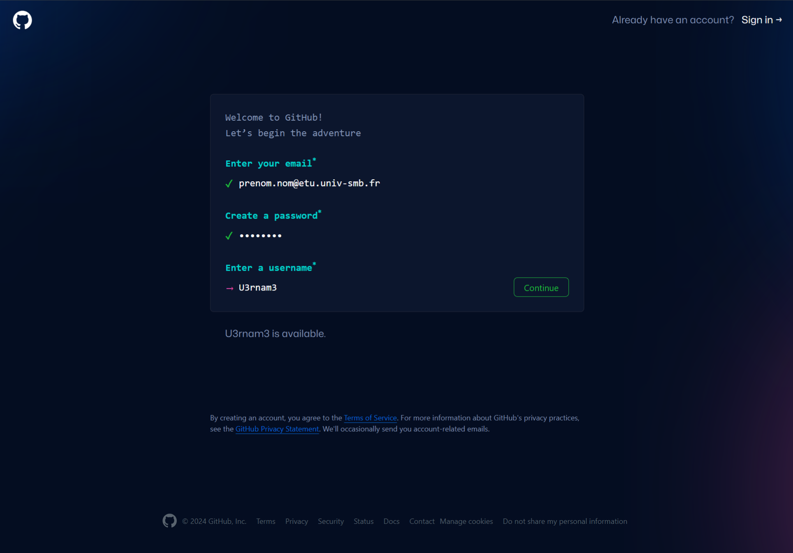

 

# Documentation : Création d'un Dépôt

### Objectif
Ce guide explique comment créer un dépôt (repository) GitHub pas à pas, avec des captures d'écran pour rendre la démarche simple à suivre. Ce processus vous permettra de gérer et de partager du code de manière collaborative via GitHub.

## Étape 1 : Créer un compte GitHub

1. Rendez-vous sur [GitHub.com](https://github.com/) et cliquez sur **Sign up** pour créer un compte si vous n’en avez pas encore.

     
   (Capture d'écran du formulaire d'inscription à GitHub.)

2. Suivez les instructions pour valider votre compte et personnaliser votre profil.

---

## Étape 2 : Créer un nouveau dépôt

1. Une fois connecté, cliquez sur le **bouton +** en haut à droite de la page, puis sélectionnez **New repository**.

     
   $$\space$$
   (Capture d'écran de l'emplacement pour créer un nouveau dépôt.)

3. Vous arriverez sur la page de création de dépôt. Remplissez les informations suivantes :
   - **Repository name** : Donnez un nom à votre dépôt. Par exemple, "mon-premier-depot".
   - **Description** (facultatif) : Vous pouvez ajouter une courte description de votre projet.
   - **Public ou Private** : Choisissez si le dépôt sera public (visible par tous) ou privé (visible uniquement par vous et les personnes que vous invitez).

     
    (Capture d'écran de la configuration du dépôt.)

4. (Optionnel) Cochez les options suivantes :
   - **Initialize this repository with a README** : Pour créer un fichier README.md de base.
   - **Add .gitignore** : Pour ignorer certains fichiers dans Git.
   - **Choose a license** : Sélectionnez une licence pour définir les droits d'utilisation de votre projet.

5. Cliquez sur **Create repository** pour finaliser la création du dépôt.

## Étape 3 : Cloner le dépôt localement

1. Une fois le dépôt créé, vous serez redirigé vers sa page principale. Pour travailler sur votre projet localement, cliquez sur **Code** puis copiez l'URL affichée.

     
   *Capture d'écran de l'option pour cloner le dépôt.*

2. Dans votre terminal, utilisez la commande suivante pour cloner le dépôt sur votre machine :
   ```bash
   git clone https://github.com/votre-compte/mon-premier-depot.git

3.Travaillez sur votre projet localement en ajoutant des fichiers, en les modifiant ou en les supprimant. Ensuite, utilisez les commandes suivantes pour pousser les changements sur GitHub :

  - **git add** .
  - **git commit -m "Votre message de commit**
  - **git push origin main**

## Étape 4 : Gérer les collaborateurs

1. Pour ajouter des collaborateurs, allez dans l'onglet Settings de votre dépôt.

2. Cliquez sur Collaborators dans le menu latéral gauche, puis ajoutez les noms d'utilisateur GitHub des personnes que vous souhaitez inviter.  

  
(Captures d'écran pour ajouter un collaborateur.)

3. Chaque personne recevra une invitation par e-mail pour collaborer sur votre dépôt.

## Étape 5 : Suivi des tâches avec Issues et Pull Requests

A. **Créer une Issue**

1. Pour suivre les tâches ou signaler des bugs, utilisez les Issues. Accédez à l'onglet Issues et cliquez sur New issue.

  
(Capture d'écran de la création d'une issue.)

2. Donnez un titre et une description à votre issue, et vous pouvez l'assigner à un collaborateur ou ajouter des labels.

B. **Créer une Pull Request**

1. Après avoir modifié du code sur une branche, créez une Pull Request. Allez dans l'onglet Pull requests et cliquez sur New pull request.

  
(Capture d'écran de la création d'une Pull Request.)

2. Comparez les branches, ajoutez une description des changements effectués, puis soumettez la Pull Request pour révision.

### Conclusion :

Votre dépôt GitHub est maintenant configuré et prêt à être utilisé. Vous pouvez commencer à coder, collaborer avec d'autres développeurs, suivre l'avancement de vos tâches et gérer les versions de votre projet.

Pour plus de détails sur l'utilisation de GitHub, consultez la documentation officielle GitHub.


