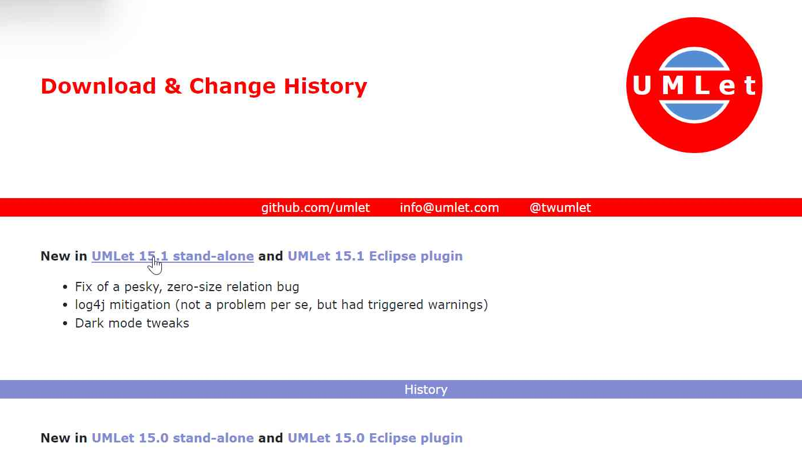

<table style="border:0px solid white>
  <tr>
    <td></td>
    <td>UMLet est un outil UML open source sur GitHub avec une interface utilisateur simple : dessinez rapidement des diagrammes UML, exportez des diagrammes vers eps, pdf, jpg, svg et presse-papiers, créez de nouveaux éléments UML personnalisés.</td>
    
  </tr>

</table>

<h2>Étapes d'accès (comment télécharger et ouvrir l'application)</h2>

<h3>Télécharger l'application</h3>

1. Se rendre sur le site: https://www.umlet.com/changes.htm
2. Appuyer sur `UMLet 15.1 stand-alone` (ou une version ultérieure) comme ci-dessous:  

  
3. Choisir l'emplacement du fichier .zip contenant l'application

